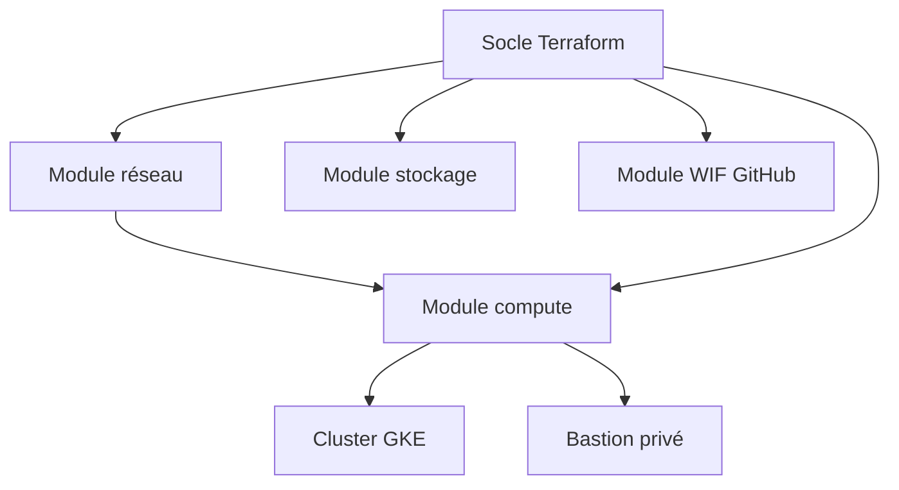

# FoodTrack — Infrastructure GCP et pipeline CI/CD

Dépôt du projet final de la formation AJC Ingénieur Cloud OPS

## Présentation

FoodTrack est un projet de formation visant à déployer une application conteneurisée sur Google Cloud en appliquant des pratiques d’Infrastructure as Code (ou IaC), d’orchestration Kubernetes et d’intégration continue.

L’infrastructure est décrite avec Terraform, les ressources applicatives sont déployées sur Google Kubernetes Engine avec Kustomize, et GitHub Actions automatise les contrôles de qualité, les analyses de sécurité et les déploiements.

Le projet utilise le projet Google Cloud suivant :

```text
form-gke-eleve01-4621
```

L’infrastructure est déployée dans la région :

```text
europe-west8
```

## Objectifs techniques

Le projet met en œuvre les éléments suivants :

* un réseau GCP privé créé avec Terraform ;
* un cluster GKE utilisant des nœuds sans adresse IP publique ;
* un bastion accessible avec Identity-Aware Proxy ;
* un Cloud NAT pour les sorties Internet des ressources privées ;
* des buckets Cloud Storage pour les sauvegardes et les journaux ;
* un dépôt Artifact Registry pour les images de conteneurs ;
* trois environnements applicatifs Kubernetes : développement, test et production ;
* une authentification GitHub Actions vers Google Cloud sans clé JSON ;
* un pipeline intégrant validation, analyse de sécurité, construction et déploiement.

## Choix d’architecture

Le projet repose sur un socle Google Cloud partagé comprenant un VPC, un cluster GKE, un bastion, des espaces de stockage et un dépôt d’images.

Les environnements applicatifs ne correspondent pas à trois clusters distincts. Ils sont isolés dans le cluster GKE grâce à trois namespaces Kubernetes :

```text
foodtrack-dev
foodtrack-test
foodtrack-prod
```

Chaque environnement possède également son overlay Kustomize afin d’adapter les manifestes Kubernetes sans dupliquer l’ensemble de leur contenu.

Les trois fichiers Terraform demandés par le cahier des charges sont conservés :

```text
dev.tfvars
test.tfvars
prod.tfvars
```

Ils représentent des profils de paramétrage du socle et permettent de rendre visibles les différences prévues entre les environnements. Ils ne constituent cependant pas trois infrastructures indépendantes, car le projet utilise un seul projet GCP, un seul cluster GKE et un state Terraform partagé.

Cette architecture a été retenue afin de respecter les contraintes pédagogiques du projet tout en évitant de multiplier les clusters et les ressources GCP. La séparation entre développement, test et production est donc principalement assurée au niveau Kubernetes.

## Architecture générale

L’infrastructure est organisée sous la forme d’un socle Terraform racine qui assemble quatre modules spécialisés.



Le module `compute` dépend du module `reseau`, car la création du cluster et du bastion nécessite les identifiants du VPC, du sous-réseau et des plages secondaires Kubernetes.

Les modules `stockage` et `wif-github` sont indépendants du réseau :

* le premier crée les espaces de stockage et le dépôt d’images ;
* le second configure l’identité utilisée par GitHub Actions.

### Organisation réseau

Le projet utilise un VPC personnalisé plutôt que le réseau GCP par défaut. La création automatique des sous-réseaux est désactivée afin de conserver la maîtrise du plan d’adressage.

Le sous-réseau possède trois plages d’adresses :

| Usage                  | Plage         |
| ---------------------- | ------------- |
| Ressources principales | `10.0.0.0/20` |
| Pods Kubernetes        | `10.4.0.0/14` |
| Services Kubernetes    | `10.8.0.0/20` |

Les plages des pods et des services sont déclarées comme plages secondaires du sous-réseau. Elles permettent à GKE de fonctionner en mode VPC natif et évitent de mélanger les adresses des machines avec celles des objets Kubernetes.

Le plan de contrôle du cluster utilise une quatrième plage dédiée :

```text
172.16.0.0/28
```

### Accès Internet des ressources privées

Les nœuds GKE et le bastion ne possèdent pas d’adresse IP publique.

Un Cloud Router et un Cloud NAT permettent néanmoins aux ressources privées d’établir des connexions sortantes, par exemple pour télécharger des images de conteneurs ou contacter des services externes.

Le NAT autorise les sorties Internet sans rendre les machines directement accessibles depuis Internet.

### Accès administratif au bastion

Le bastion est accessible avec Identity-Aware Proxy. La règle de pare-feu SSH accepte uniquement la plage utilisée par IAP :

```text
35.235.240.0/20
```

L’authentification au système repose sur OS Login. Cette solution évite d’attribuer une adresse IP publique au bastion et centralise le contrôle des accès dans IAM.

### Cluster Kubernetes

Le cluster GKE est zonal et utilise un node pool géré séparément du cluster.

Les nœuds sont privés :

```hcl
enable_private_nodes = true
```

Le plan de contrôle conserve cependant un endpoint public :

```hcl
enable_private_endpoint = false
```

Le cluster ne doit donc pas être présenté comme entièrement privé. Ce choix simplifie l’administration pendant le projet, tandis que les accès restent soumis à l’authentification et aux autorisations Google Cloud.

Les trois environnements applicatifs sont isolés dans le cluster avec les namespaces suivants :

| Environnement | Namespace        |
| ------------- | ---------------- |
| Développement | `foodtrack-dev`  |
| Test          | `foodtrack-test` |
| Production    | `foodtrack-prod` |

### State Terraform distant

Le state Terraform est conservé dans un bucket Cloud Storage :

```text
foodtrack-a-tfstate-form-gke-eleve01-4621
```

avec le préfixe :

```text
terraform/state
```

Ce backend distant permet aux membres du groupe et au pipeline de travailler à partir du même état de référence.

Le bucket du backend doit exister avant l’exécution de `terraform init`. Il ne peut pas être créé par la configuration Terraform qui dépend elle-même de ce state : il constitue donc une ressource d’amorçage créée séparément.

## Organisation des modules Terraform

La configuration Terraform est séparée en quatre modules afin d’isoler les responsabilités et de faciliter la lecture, la maintenance et la réutilisation du code.

```text
terraform/
├── main.tf
├── variables.tf
├── outputs.tf
├── backend.tf
├── providers.tf
├── versions.tf
└── modules/
    ├── reseau/
    ├── compute/
    ├── stockage/
    └── wif-github/
```

### Socle racine

Le socle racine orchestre les modules. Il ne crée pas directement les principales ressources GCP : il transmet les variables, relie les modules et expose les informations utiles sous forme d’outputs.

La liaison entre le réseau et le compute est réalisée avec les outputs du module `reseau` :

```hcl
network_id          = module.reseau.network_id
subnetwork_id       = module.reseau.subnetwork_id
pods_range_name     = module.reseau.pods_range_name
services_range_name = module.reseau.services_range_name
```

Cette liaison évite de recopier manuellement les identifiants des ressources. Terraform connaît également la dépendance entre les modules et construit le réseau avant le cluster.

### Module `reseau`

Le module `reseau` crée les composants nécessaires aux communications du projet :

* un VPC personnalisé ;
* un sous-réseau régional ;
* une plage principale pour les machines ;
* une plage secondaire pour les pods ;
* une plage secondaire pour les services Kubernetes ;
* un Cloud Router ;
* un Cloud NAT ;
* une règle de pare-feu SSH dédiée au bastion.

La propriété suivante active l’accès privé aux API Google depuis le sous-réseau :

```hcl
private_ip_google_access = true
```

Le module expose ensuite les identifiants du réseau et les noms des plages secondaires. Ces informations sont consommées par le module `compute`.

### Module `compute`

Le module `compute` crée :

* le cluster GKE zonal ;
* le node pool ;
* le bastion d’administration.

Le node pool créé automatiquement par GKE est supprimé :

```hcl
remove_default_node_pool = true
```

Un node pool distinct est ensuite déclaré avec Terraform. Cette séparation permet de contrôler explicitement :

* le nombre de nœuds ;
* le type de machine ;
* le type et la taille des disques ;
* le compte de service ;
* les labels et les tags réseau.

Le cluster utilise les plages secondaires fournies par le module réseau :

```hcl
ip_allocation_policy {
  cluster_secondary_range_name  = var.pods_range_name
  services_secondary_range_name = var.services_range_name
}
```

Le bastion utilise le même VPC et le même sous-réseau que le cluster. Il ne possède pas de bloc `access_config`, et donc aucune adresse IP publique.

L’option suivante autorise Terraform à arrêter la VM lorsqu’une modification l’exige, par exemple lors d’un changement de type de machine :

```hcl
allow_stopping_for_update = true
```

### Module `stockage`

Le module `stockage` crée deux buckets Cloud Storage.

Le bucket de sauvegardes conserve les données destinées à la restauration :

```text
foodtrack-a-backups-form-gke-eleve01-4621
```

Le bucket de logs stocke les exports de journaux :

```text
foodtrack-a-logs-form-gke-eleve01-4621
```

Une règle de cycle de vie supprime automatiquement les objets du bucket de logs après 30 jours. Elle permet de limiter l’accumulation de données et les coûts de stockage.

Les deux buckets utilisent l’accès uniforme :

```hcl
uniform_bucket_level_access = true
```

Les droits sont ainsi gérés avec IAM au niveau du bucket, sans utiliser d’ACL individuelles sur les objets.

La propriété suivante empêche Terraform de supprimer automatiquement un bucket qui contient encore des objets :

```hcl
force_destroy = false
```

Le module crée également le dépôt Docker Artifact Registry :

```text
foodtrack-a-images
```

Ce dépôt reçoit les images produites ou publiées par le pipeline GitHub Actions.

### Module `wif-github`

Le module `wif-github` a été fourni avec le projet puis intégré au socle Terraform. Il permet à GitHub Actions de s’authentifier auprès de Google Cloud sans stocker de clé JSON.

Il crée quatre éléments principaux :

1. un pool d’identités externes ;
2. un fournisseur OIDC faisant confiance aux jetons signés par GitHub ;
3. un compte de service utilisé par le pipeline ;
4. une liaison IAM autorisant le dépôt GitHub à emprunter ce compte.

La condition suivante limite la fédération au dépôt attendu :

```hcl
attribute_condition = "assertion.repository == \"${var.github_owner}/${var.github_repo}\""
```

Une exécution provenant d’un autre dépôt ne peut donc pas utiliser cette identité.

Le compte de service du pipeline reçoit initialement deux rôles :

| Rôle                            | Utilisation                                   |
| ------------------------------- | --------------------------------------------- |
| `roles/artifactregistry.writer` | Publication des images dans Artifact Registry |
| `roles/container.developer`     | Accès aux ressources Kubernetes du cluster    |

Le module permet d’ajouter des rôles avec `roles_supplementaires`, mais chaque droit supplémentaire doit être justifié selon le principe du moindre privilège.

Après l’application du module, deux outputs sont nécessaires à GitHub Actions :

```text
wif_provider_name
ci_service_account_email
```

Ils sont enregistrés dans les variables GitHub `WIF_PROVIDER` et `CI_SERVICE_ACCOUNT`. Ces valeurs identifient des ressources mais ne contiennent aucun secret.


## Dimensionnement GKE

Le Bastion SSH (e2-micro)
Ce choix repose sur le principe du moindre privilège et de l'optimisation des coûts. L'instance e2-micro offre 2 vCPU partagés et 1 Go de RAM, ce qui est largement suffisant pour jouer son rôle de pont sécurisé vers le réseau privé de GCP. Comme elle ne traite aucune charge applicative et ne sert qu'à relayer tes commandes kubectl ou tes accès SSH, surdimensionner cette machine serait un gaspillage budgétaire, d'autant qu'elle rentre dans le cadre des ressources à très faible coût de GCP.

Le nombre de nœuds GKE (node_count = 2)
Le choix d'un cluster à deux nœuds permet de garantir la haute disponibilité minimale requise par Kubernetes tout en limitant les frais d'infrastructure. Déployer un seul nœud créerait un point unique de défaillance (Single Point of Failure), rendant le système vulnérable à la moindre maintenance ou panne d'instance. Avec deux worker nodes, Kubernetes peut répartir intelligemment les Pods applicatifs, assurer la résilience de vos microservices et valider le comportement du cluster en conditions réelles sans multiplier la facture par trois ou quatre.

Le type de machine des nœuds (machine_type = "e2-standard-2")
En attribuant 2 vCPU et 8 Go de RAM par nœud, le cluster dispose d'un total cumulé de 4 vCPU et 16 Go de mémoire vive. Ce dimensionnement est idéal car les composants internes de Kubernetes (comme le CNI, le CSI ou le metrics-server) consomment déjà entre 1 et 1,5 Go de RAM par nœud. Des machines plus petites comme des e2-micro ou e2-small provoqueraient rapidement des pannes par manque de mémoire (Out Of Memory), tandis que cette configuration offre la marge nécessaire pour faire tourner l'ensemble des conteneurs applicatifs de manière stable.

La taille des disques système (node_disk_size_gb = 50)
Chaque nœud embarque un disque persistant de 50 Go, ce qui représente le parfait compromis pour un environnement de développement et de test. L'système d'exploitation des nœuds (Container-Optimized OS) étant très léger, il occupe moins de 5 Go d'espace. Les 45 Go restants sont alloués au stockage des images Docker en cache et aux volumes temporaires des Pods. Réduire la taille par défaut de GCP (qui est de 100 Go) à 50 Go permet de diviser immédiatement par deux la facture liée au stockage bloc sans impacter les performances de vos déploiements.

## Justification de la configuration par environnement avec Kustomize

Nous avons choisi de partir sur Kustomize pour la séparation par environnement pour sa facilité d'exécution et ses capacités adaptées à notre projet de petite envergure. De plus, Kustomize est présent directement dans Cloud Shell.

Créer une copie de fichier par environnement pose un véritable problème d'optimisation, tandis qu'envsubst ne propose pas les avantages de confort de Kustomize.
Nous avons également consideré Helm pour réaliser ce projet, mais après de plus amples recherches et discussions au sein du groupe, nous en avons conclu qu'il était trop fourni pour un projet de cette taille.

### Changements effectués par environnement dans Kustomize :

| Fichier concerné dans la base     | Cible                           | Path de l'attribut patched                                   | Valeur dans la base                                                  | Valeur dans l'environnement de développement | Valeur dans l'environnement de test        | Valeur dans l'environnement de production  | <div style="width:5=300px">Justification</div>                                                                                                                                                                                                                                                                                                |
| --------------------------------- | ------------------------------- | ------------------------------------------------------------ | -------------------------------------------------------------------- | -------------------------------------------- | ------------------------------------------ | ------------------------------------------ | --------------------------------------------------------------------------------------------------------------------------------------------------------------------------------------------------------------------------------------------------------------------------------------------------------------------------------------------- |
| 00-namespace.yaml                 | Le Namespace "foodtrack"        | /metadata/name                                               | foodtrack                                                            | foodtrack-dev                                | foodtrack-test                             | foodtrack-prod                             | Il est demandé dans le cahier des charges d'avoir un namespace différent par environnement                                                                                                                                                                                                                                                    |
| 00-namespace.yaml                 | Le Namespace "foodtrack"        | /metadata/labels/foodtrack.example~1env                      | dev                                                                  | dev                                          | test                                       | prod                                       | foodtrack.example/env est un indicateur de l'environnement comme label assigné au namespace.                                                                                                                                                                                                                                                  |
| 01-configmap.yaml                 | La ConfigMap "foodtrack-config" | /data/SEUIL_TEMPERATURE_C                                    | 4                                                                    | 10                                           | 5                                          | 4                                          | En développement, 10 est utilisé comme une variable placeholder, choisie arbitrairement. On suppose une situation où 5 s'avère être une valeur fonctionnelle en environnement de test, mais on utilisera 4 en environnement de production pour une couche supplémentaire de sécurité en déclenchant des alarmes à une température plus basse. |
| 01-configmap.yaml                 | La ConfigMap "foodtrack-config" | /data/NIVEAU_JOURNAL                                         | debug                                                                | debug                                        | info                                       | warn                                       | En dev puis en test, on utilise des niveaux plus bas car on provoquera volontairement des alertes. En environnement de production, on attend un niveau plus élevé de log car une alerte est réelle                                                                                                                                            |
| 01-configmap.yaml                 | La ConfigMap "foodtrack-config" | /data/index.html                                             | [...]\<p>Environnement : a differencier par environnement.\</p>[...] | [...]\<p\>Environnement : dev.\</p\>[...]    | [...]\<p\>Environnement : test.\</p\>[...] | [...]\<p\>Environnement : prod.\</p\>[...] | La page de l'API doit afficher l'environnement actuel                                                                                                                                                                                                                                                                                         |
| 03-deployment-portail-qualite.yml | Le Deployment "portail-qualite" | /spec/replicas                                               | 2                                                                    | 1                                            | 2                                          | 3                                          | On n'a pas besoin de plus de répliques en dev car on ne fait que développer l'app, pas tester sa disponibilité; On en met 2 en test pour faire ces tests de disponibilité puis 3 en production pour garantir sa disponibilité auprès des utilisateurs.                                                                                        |
| 03-deployment-portail-qualite.yml | Le Deployment "portail-qualite" | /spec/strategy/rollingUpdate/maxSurge                        | 1                                                                    | 1                                            | 1                                          | 2                                          | Notre budget étant réduit, on n'alloue que 2 pods en Surge à l'environnement de producton pour garantir la disponibilité de l'app lors des updates.                                                                                                                                                                                           |
| 04-deployment-api-capteurs.yml    | Le Deployment "api-capteurs"    | /spec/replicas                                               | 2                                                                    | 1                                            | 2                                          | 3                                          | *Voir justification pour le Deployment "portail-qualite"*                                                                                                                                                                                                                                                                                     |
| 04-deployment-api-capteurs.yml    | Le Deployment "api-capteurs"    | /spec/strategy/rollingUpdate/maxSurge                        | 1                                                                    | 1                                            | 1                                          | 2                                          | *Voir justification pour le Deployment "portail-qualite"*                                                                                                                                                                                                                                                                                     |
| 05-statefulset-cache-releves.yaml | Le StatefulSet "cache-reveles"  | /spec/volumeClaimTemplates/0/spec/resources/requests/storage | 10Gi                                                                 | 10Gi                                         | 30Gi                                       | 50Gi                                       | On aura besoin de plus de stockage lors du déploiement en production. On alloue 30 à test pour ne pas provoquer des erreurs à cause du manque de cache, mais 50Gi ne sont pas nécessaires.                                                                                                                                                    |

Nous avons aussi ajouté deux snippet de YAML dans chaque fichier `kustomization.yaml` :

##### secretGenerator

```yaml
secretGenerator:
- name: foodtrack-api-config
  envs:
  - secret.env
```

C'est un générateur de secret. Une approche qui utilise un fichier de variables d'environnement (`envs`, plutôt que `literals` ou `files`) permet de récupérer les secrets dans le fichier `secret.env`, ajouté au .gitignore, lors du build, sans jamais les écrire en clair dans un manifest (ce que fait `literals`) ou un fichier texte (ce que fait `files`). Les fichiers d'environnement ne sont pas push sur notre dépôt.

##### Fichier de patch pour le Horizontal Pod Autoscaler

```yaml
- path: HPA-foodtrack-patch.yaml
```

qui ajoute les patches contenus dans le fichier `HPA-foodtrack-patch.yaml`, qui remplacent les valeurs dans `HPA-foodtrack.yaml` et sont les suivants :

- Environnement de développement :

```yaml
apiVersion: autoscaling/v2
kind: HorizontalPodAutoscaler
metadata:
  name: api-capteurs
spec:
  minReplicas: 1
  maxReplicas: 3
  metrics:
  - type: Resource
    resource:
      name: cpu
      target:
        type: Utilization
        averageUtilization: 80
```

- Environnement de test :

```yaml
apiVersion: autoscaling/v2
kind: HorizontalPodAutoscaler
metadata:
  name: api-capteurs
spec:
  minReplicas: 2
  maxReplicas: 4
  metrics:
  - type: Resource
    resource:
      name: cpu
      target:
        type: Utilization
        averageUtilization: 70
```

- Environnement de production :

```yaml
apiVersion: autoscaling/v2
kind: HorizontalPodAutoscaler
metadata:
  name: api-capteurs
spec:
  minReplicas: 3
  maxReplicas: 6
  metrics:
  - type: Resource
    resource:
      name: cpu
      target:
        type: Utilization
        averageUtilization: 60
```

On justifie ces patches par les besoins plus grands dans un environnement de production que dans un environnement de développement ou de testing en quantité de répliques, car la disponibilité de l'application est une priorité ; Du côté de l'utilisation CPU, on peut supporter une utilisation plus élevée en environnement de développement ou de test pour tester l'application mais on préfère la réduire en production pour éviter des crashes. 

## Justification de la politique de sécurité Trivy

La pipeline bloque la publication et le déploiement lorsque l'on a une mauvaise configuration ou une vulnérabilité de type CRITICAL. Nous avons paramétré Trivy de cette façon, car la vulnérabilité CRITICAL a assez d'importance pour empêcher la mise en production de l'artéfact. Nous avons considéré un blocage sur une gravité HIGH mais le cahier des charges requérait l'utilisation d'images, parmi lesquelles `us-docker.pkg.dev/google-samples/containers/gke/hello-app:2.0`, qui contient 16 vulnérabilités de gravité HIGH. N'ayant aucun pouvoir sur ces images, nous devons accepter ces vulnérabilités et donc adoucir notre politique de sécurité en ne bloquant que sur CRITICAL. D'un autre côté, les niveaux MEDIUM et LOW ne bloquent pas la pipeline, ces deux niveaux pouvant être possiblement du bruit, on limite donc cette possibilité.

En ce qui concerne les images, nous avons choisi le même type de sévérité, pour les mêmes raisons que la configuration. Cependant, un paramètre bloque le pipeline, si les vulnérabilités possèdent un correctif. Dans ce cas là, la pipeline impose la mise à jour avec ce correctif, ou alors le remplacement de cette image. 

## Justification des choix d'implémentation du script de contrôle de santé :

Pour assurer la supervisabilité de l'API capteurs en phase d'exploitation, nous avons développé un script Python autonome qui évalue non seulement la disponibilité globale (statut HTTP 200), mais aussi la qualité de service en mesurant la latence d'exécution. Pour garantir une empreinte mémoire minimale et faciliter son déploiement dans des conteneurs légers ou des CronJobs Kubernetes, le script repose exclusivement sur la bibliothèque standard Python (urllib, time, sys), éliminant ainsi toute dépendance externe. Il suit strictement les normes d'exécution UNIX en renvoyant un code de sortie explicite (0 pour un fonctionnement nominal, 1 en cas de panne applicative ou réseau, et 2 en cas de dégradation de la latence) pour permettre l'interruption immédiate des pipelines CI/CD en cas d'anomalie. Enfin, la paramétrisation dynamique des cibles et des seuils tolérés via des variables d'environnement (API_URL, MAX_LATENCY_SEC) garantit sa réutilisabilité intégrale à travers les différents environnements de déploiement (développement, test, prod).
